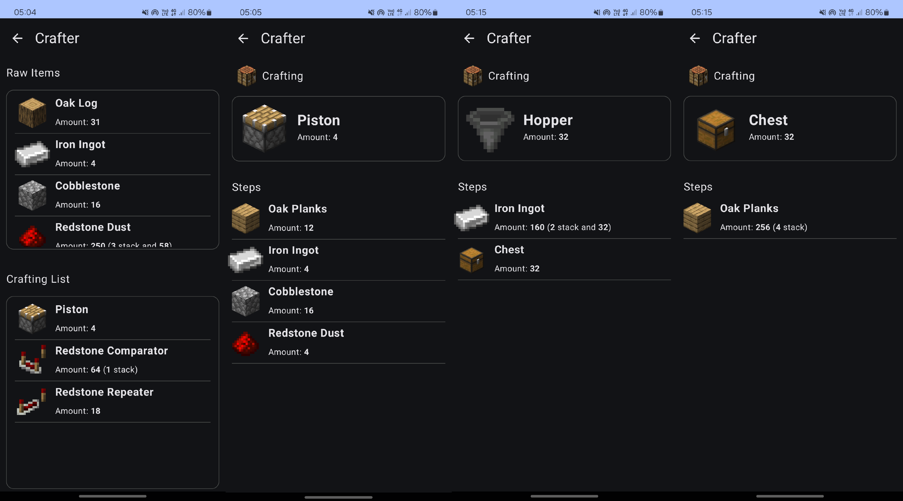
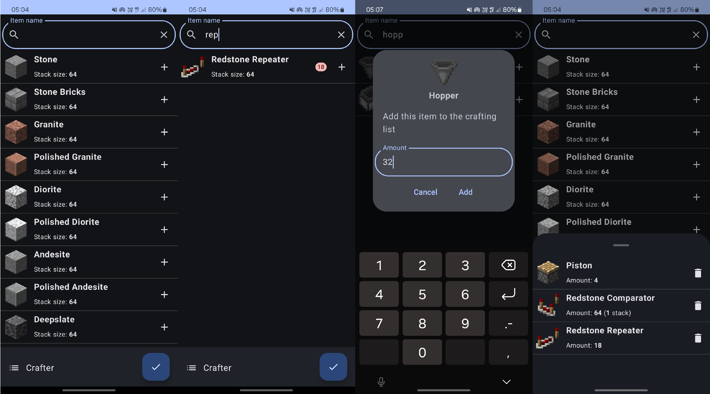

# Crafter

Crafter is companion app for Minecraft. It helps with crafting recipes, builds a recipe tree so you can efficiently craft multiple items. 

**_Currently in development_**.

## Table of Contents

- [Crafter](#crafter)
    - [Table of Contents](#table-of-contents)
    - [Introduction](#introduction)
    - [Features](#features)
    - [TODOs](#todos)
    - [Building](#installation)
    - [Usage](#usage)
    - [Contributing](#contributing)
    - [Adding new recipes and items](#adding-new-recipes-and-items)
    - [License](#license)
    - [Contact](#contact)

## Introduction

Projects aims to assist with crafting long list of items for Minecraft. There are some websites provide such functionality but no mobile application and using native application is better than webapp sometimes thus this project is being developed.

## Features

List of key features and functionalities of the project.

- UI for recipe steps
- List of raw materials for recipe list

## TODOs

List of features to do:

- Tracking left-overs
- Using existing items from inventory
- Recipe tree visualization
- add multiple recipes for single item
- add recipe switch between multiple recipes

## Building

Step-by-step instructions on how to build and set up the project.

1. Clone the repository: `git clone https://github.com/fracta7/crafter.git`
2. Navigate to the project directory: `cd crafter`
3. Open with Android Studio.
4. Build and Run

## Usage

Simply search for items and them to you crafting list, then click `craft!`

Screenshots:




## Contributing

If you wish to contribute, feel free. Fork the project and do Pull Request, I will check the code and if everything is good, it will be merged. :)

## Adding new recipes and items

In order to add new item and recipes, follow these steps:

- add entry in `com.fracta7.crafter.data.repository.ItemInit.kt` for items
- add entry in `com.fracta7.crafter.data.repository.RecipeInit.kt` for recipes

Item data class is structured following way:

```kotlin
data class Item(
    val id: String,
    val name: String,
    val stackSize: Int,
    val craftable: Boolean
)
```

Recipe is structured following way:

```kotlin
data class Recipe(
    val result: Item,
    val resultQuantity: Int,
    val requirements: Map<Item, Int>,
    val recipeType: RecipeType
)
```

Recipe Types:

```kotlin
sealed class RecipeType {
  data object Crafting : RecipeType(name = "Crafting", item = "crafting_table")
  data object Smelting : RecipeType(name = "Smelting", item = "furnace")
  data object Stripping : RecipeType(name = "Stripping", item = "diamond_axe")
  data object Watering : RecipeType(name = "Watering", item = "water_bucket")
  data object Cutting : RecipeType(name = "Cutting", item = "stonecutter")
  data object Oxidation : RecipeType(name = "Oxidation", item = "oxidized_copper")
  data object Waxing : RecipeType(name = "Waxing", item = "honeycomb")
  data object Smithing : RecipeType(name = "Smithing", item = "smithing_table")
}
```

To add new item to the registry, add a new line in `ItemInit.kt` with item properties in the function body inside the list:

```kotlin
fun itemInit(): List<Item> {
    return listOf(
        Item(id = "stone", name = "Stone", stackSize = 64, craftable = false),
        Item(id = "diamond", name = "Diamond", stackSize = 64, craftable = false),
        //... add new items here
        )
}
```

To add new recipe to the registry, add a new line in `RecipeInit.kt` with recipe properties in the function body inside the list:

```kotlin
fun recipeInit(itemRegistry: ItemRegistry): List<Recipe> {
    return listOf(
        Recipe(
            result = itemRegistry.getItem("polished_granite")!!,
            resultQuantity = 1,
            requirements = mapOf(itemRegistry.getItem("granite")!! to 1),
            recipeType = RecipeType.Cutting
        ),
        Recipe(
            result = itemRegistry.getItem("polished_diorite")!!,
            resultQuantity = 1,
            requirements = mapOf(itemRegistry.getItem("diorite")!! to 1),
            recipeType = RecipeType.Cutting
        ),
        //... add new recipes here
    )
}
```       

## License
MIT License

Copyright (c) 2024 Javokhir Matnazarov

Permission is hereby granted, free of charge, to any person obtaining a copy
of this software and associated documentation files (the "Software"), to deal
in the Software without restriction, including without limitation the rights
to use, copy, modify, merge, publish, distribute, sublicense, and/or sell
copies of the Software, and to permit persons to whom the Software is
furnished to do so, subject to the following conditions:

The above copyright notice and this permission notice shall be included in all
copies or substantial portions of the Software.

THE SOFTWARE IS PROVIDED "AS IS", WITHOUT WARRANTY OF ANY KIND, EXPRESS OR
IMPLIED, INCLUDING BUT NOT LIMITED TO THE WARRANTIES OF MERCHANTABILITY,
FITNESS FOR A PARTICULAR PURPOSE AND NON INFRINGEMENT. IN NO EVENT SHALL THE
AUTHORS OR COPYRIGHT HOLDERS BE LIABLE FOR ANY CLAIM, DAMAGES OR OTHER
LIABILITY, WHETHER IN AN ACTION OF CONTRACT, TORT OR OTHERWISE, ARISING FROM,
OUT OF OR IN CONNECTION WITH THE SOFTWARE OR THE USE OR OTHER DEALINGS IN THE
SOFTWARE.

## Contact

If you wish to contact me my Email: `fracta7@gmail.com`