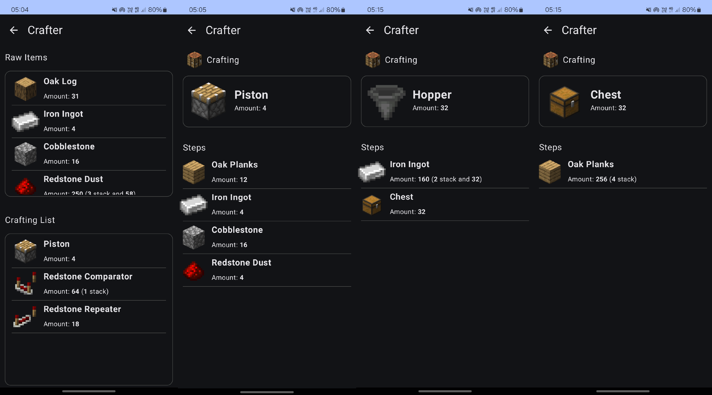
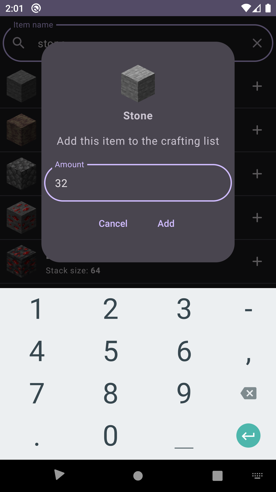
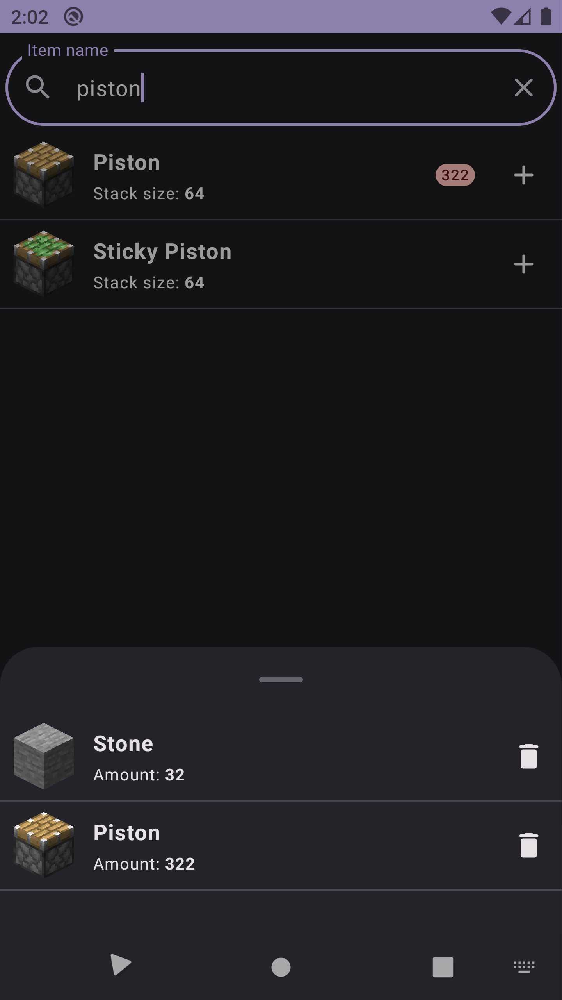

# Crafter

Crafter is companion app for Minecraft. It helps with crafting recipes, builds a recipe tree so you can efficiently craft multiple items. 

**_Currently in development_**.

## Table of Contents

- [Crafter](#crafter)
    - [Table of Contents](#table-of-contents)
    - [Introduction](#introduction)
    - [Features](#features)
    - [TODOs](#todos)
    - [Building](#installation)
    - [Usage](#usage)
    - [Contributing](#contributing)
    - [License](#license)
    - [Contact](#contact)

## Introduction

Projects aims to assist with crafting long list of items for Minecraft. There are some websites provide such functionality but no mobile application and using native application is better than webapp sometimes thus this project is being developed.

## Features

List of key features and functionalities of the project.

- _In development_

## TODOs

List of features to do:

- Recipe tree building logic
- Proper UI for crafting, for everything :)
- Tracking left-overs
- Using existing items from inventory
- Recipe tree visualization
- Optimize the search function
- Optimize the image renders

## Building

Step-by-step instructions on how to build and set up the project.

1. Clone the repository: `git clone https://github.com/fracta7/crafter.git`
2. Navigate to the project directory: `cd crafter`
3. Open with Android Studio.

## Usage

Simply search for items and them to you crafting list, then click `craft!`

## Contributing

If you wish to contribute, feel free. Fork the project and do Pull Request, I will check the code and if everything is good, it will be merged. :)

## License
MIT License

Copyright (c) 2024 Javokhir Matnazarov

Permission is hereby granted, free of charge, to any person obtaining a copy
of this software and associated documentation files (the "Software"), to deal
in the Software without restriction, including without limitation the rights
to use, copy, modify, merge, publish, distribute, sublicense, and/or sell
copies of the Software, and to permit persons to whom the Software is
furnished to do so, subject to the following conditions:

The above copyright notice and this permission notice shall be included in all
copies or substantial portions of the Software.

THE SOFTWARE IS PROVIDED "AS IS", WITHOUT WARRANTY OF ANY KIND, EXPRESS OR
IMPLIED, INCLUDING BUT NOT LIMITED TO THE WARRANTIES OF MERCHANTABILITY,
FITNESS FOR A PARTICULAR PURPOSE AND NON INFRINGEMENT. IN NO EVENT SHALL THE
AUTHORS OR COPYRIGHT HOLDERS BE LIABLE FOR ANY CLAIM, DAMAGES OR OTHER
LIABILITY, WHETHER IN AN ACTION OF CONTRACT, TORT OR OTHERWISE, ARISING FROM,
OUT OF OR IN CONNECTION WITH THE SOFTWARE OR THE USE OR OTHER DEALINGS IN THE
SOFTWARE.

## Contact

If you wish to contact me my Email: `fracta7@gmail.com`